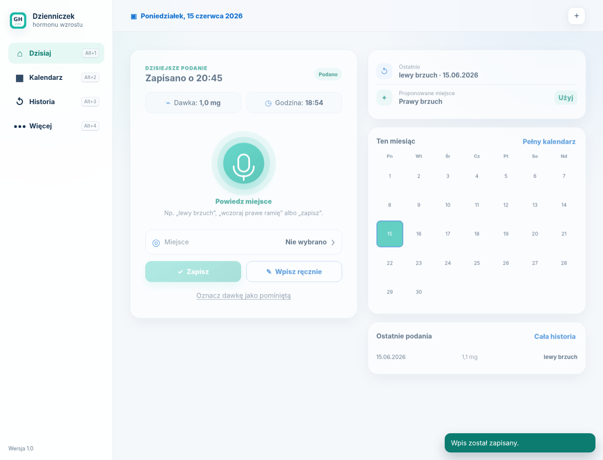
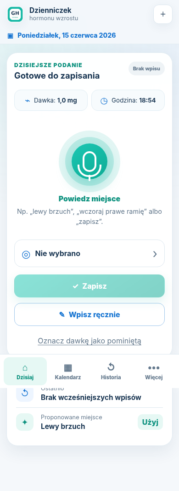

# Dzienniczek hormonu wzrostu PWA

Wersja: **1.0 - 1506262045**

Responsywna aplikacja PWA do zapisywania podań hormonu wzrostu na telefonie i komputerze. Program działa jako statyczna strona, dlatego można go publikować przez GitHub Pages.

## Najważniejsze funkcje

- szybki zapis daty, godziny, dawki i miejsca wkłucia,
- brak daty w poleceniu głosowym oznacza lokalną datę urządzenia w chwili wypowiedzenia,
- obsługa głosowa po polsku, np. „lewy brzuch”, „wczoraj prawe ramię”, „dawka jeden przecinek jeden”, „zapisz”,
- obsługa ręczna i pełna obsługa klawiaturą,
- kalendarz z oznaczeniem podań i pominiętych dawek,
- historia z filtrowaniem, edycją i usuwaniem wpisów,
- automatyczna propozycja kolejnego miejsca wkłucia,
- eksport kopii JSON oraz historii CSV,
- import kopii JSON,
- działanie offline po pierwszym poprawnym otwarciu,
- jasny interfejs dopasowany do telefonu, tabletu i komputera.

## Skróty klawiaturowe

| Skrót | Działanie |
|---|---|
| `Alt + 1` | Dzisiaj |
| `Alt + 2` | Kalendarz |
| `Alt + 3` | Historia |
| `Alt + 4` | Więcej |
| `Alt + M` | Mikrofon |
| `Alt + N` | Nowy wpis ręczny |
| `Ctrl + Enter` | Zapis przygotowanego wpisu |
| `Esc` | Zamknięcie okna lub zatrzymanie mikrofonu |

Wszystkie elementy można również obsługiwać klawiszami `Tab`, `Shift + Tab`, `Enter` i `Spacja`. W kalendarzu działają strzałki.

## Dane użytkownika

Dane są przechowywane lokalnie w pamięci przeglądarki. Repozytorium GitHub nie zawiera wpisów medycznych użytkownika.

Telefon i komputer przechowują osobne dane. Do przeniesienia historii między urządzeniami służy eksport i import pliku JSON. Automatyczna synchronizacja wymagałaby późniejszego dodania osobnej bazy danych i logowania.

## Uruchomienie lokalne

Aplikacji PWA nie należy testować przez bezpośrednie otwarcie pliku `index.html`. Uruchom prosty serwer w folderze projektu:

```powershell
python -m http.server 8080
```

Następnie otwórz:

```text
http://localhost:8080
```

## Wysłanie projektu na GitHub

Repozytorium docelowe:

```text
https://github.com/tomalawsb/Dzienniczek-hormonu-wzrostu
```

1. Rozpakuj projekt.
2. Otwórz jego główny folder.
3. Kliknij prawym przyciskiem `upload_to_github.ps1` i wybierz uruchomienie w PowerShell albo uruchom:

```powershell
powershell -ExecutionPolicy Bypass -File .\upload_to_github.ps1
```

Skrypt:

- pobiera aktualne repozytorium,
- kopiuje cały projekt,
- odczytuje wersję z `app-version.json`,
- sam tworzy opis commita,
- wysyła gałąź `main` bez pytania o opis.

Przy pierwszym użyciu Git może poprosić o zalogowanie przez Git Credential Manager.

## Publikacja przez GitHub Pages

Projekt zawiera workflow `.github/workflows/deploy-pages.yml`. Po wysłaniu plików:

1. wejdź w ustawienia repozytorium,
2. otwórz sekcję **Pages**,
3. jako źródło wybierz **GitHub Actions**,
4. poczekaj na zakończenie zadania w zakładce **Actions**.

Docelowy adres powinien mieć postać:

```text
https://tomalawsb.github.io/Dzienniczek-hormonu-wzrostu/
```

## Obsługa głosowa

Aplikacja wykorzystuje mechanizm rozpoznawania mowy udostępniony przez przeglądarkę. Mikrofon wymaga zgody użytkownika oraz uruchomienia strony przez HTTPS lub `localhost`. Gdy przeglądarka nie obsługuje tej funkcji, wszystkie wpisy nadal można dodawać ręcznie i klawiaturą.

## Pliki projektu

- `index.html` – układ aplikacji,
- `style.css` – responsywny interfejs,
- `app.js` – logika danych, głosu, kalendarza i klawiatury,
- `manifest.json` – konfiguracja PWA,
- `service-worker.js` – działanie offline,
- `app-version.json` – numer wersji,
- `upload_to_github.ps1` – automatyczne wysyłanie na GitHub,
- `.github/workflows/deploy-pages.yml` – publikacja przez GitHub Pages.

## Ważne

Aplikacja nie dobiera dawki i nie zastępuje zaleceń lekarza. Zapisuje wyłącznie informacje wpisane lub wypowiedziane przez użytkownika.

## Podgląd interfejsu




